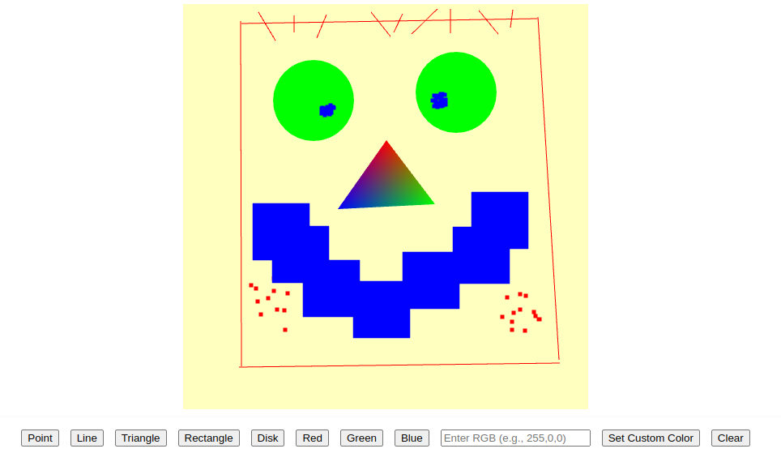

# WebGL - Lab1: Introduciton to 2D Drawing
Elijah Morgan\
CIS 367 01

### Development Info
| OS      | Browser       |
|---------|---------------|
| Windows | Firefox       |
| Ubuntu  | Chrome Browser|

### Completed Tasks
- For lines and triangles, the user can specify the vertices by clicking on the canvas, the line or the triangle is drawn when the user inputs two or three vertices.
- For squares and disks, the user only needs to click on the canvas once. The square or the disk are centered at the click position. You can specify the size of square or the disk as you desire.
- You need to change the uniform color in the code to be per vertex color. For points, lines, and triangles, the colors are per vertex. For squares and disks, the colors are per object.
